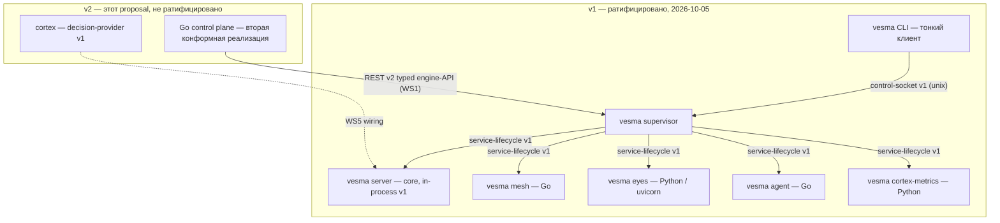

# Платформа v2 — контрактно-компонентная платформа экосистемы VESMA

> **Статус: PROPOSAL — обсуждение, не ратифицировано, не контракт.**
> Этот документ фиксирует архитектурную дискуссию владелец–TL от
> 2026-10-05/06 «по горячим следам» и является **основой для будущего
> полного АрхКома** по миграции экосистемы на платформу v2. Ничего из
> написанного здесь не меняет ратифицированные контракты; где затронуты
> ратифицированные вещи — даны точные ссылки на версии. Позиции TL
> помечены как позиции TL и **подлежат оспариванию** АрхКомом.
>
> **Гейт исполнения:** миграция на платформу v2 **не исполняется** до
> срабатывания гейта секвенсинга владельца (§6). Подготовка (этот
> документ + воркстримы §7) — разрешена и ведётся сейчас.
>
> **Язык:** нормативная проза сейчас — русская; EN-зеркало появляется при
> ратификации (правило i18n — ADR-0001 §5). Идентификаторы, поля и
> имена контрактов — EN (канон экосистемы).

## 1. Краткое резюме

**Видение владельца** (2026-10-05/06): перевод всей экосистемы VESMA —
движок `vesma`, `vesma-mesh`, `vesma-eyes`, `vesma-agent`, `vesma-cortex`,
`vesma-vitals`, будущие компоненты — на **единую архитектурную платформу
на основе спецификаций**. Одна платформа приёма, жизненного цикла,
управления и распределения для всех компонентов, ныне живущих и будущих.

**Предлагаемое имя платформы** — «**контрактно-компонентная платформа**»
(EN: *contract-first component platform*). Не «микросервисная»: один узел,
одно доверенное доменное пространство (trust domain) в v1, один
супервайзер, общий жизненный цикл, никакой межкомпонентной сетевой ткани.
Границей декомпозиции служит **контракт**, а не сеть — именно это
развязывает интерфейс от реализации и делает компоненты полиглотными.
Обоснование и отвергнутые варианты — §5.

**Три архитектурных хода** (позиции TL, §4): (A) контрольная плоскость на
Go как вторая конформная реализация спек-поверхности — после ратификации
REST v2 typed engine-API контракта; (B) лестница распределения от
install-флоу к `uv tool install` и к Python-независимому bootstrap;
(C) core остаётся in-process в v1 (ратифицировано), вынос core в
child-process — честная опция SL v2 с названной ценой.

**Гейт секвенсинга владельца** (§6): исполнение миграции стартует только
после (1) полного ребрендинга, (2) обучения и интеграции модели кортекса,
(3) доведения заявленной функциональности до продуктового уровня — графы,
рой, око, «единое мышление». До тех пор — только подготовка: семь
воркстримов (§7), ни один из которых не ломает ратифицированное v1.

## 2. Где мы — факты фазы 3

Фундамент платформы уже отгружен; это не предложение с нуля, а
надстройка над ратифицированным слоем.

- **2026-10-04** — учредительный АрхКом VESMA, ADR-0001 (структура и
  governance этого репозитория), созданы контракты v1.
- **2026-10-05** — четыре контракта сервисного трека ратифицированы
  `1.0.0` stable первой конформной реализацией (PR #1 этого репозитория):
  [component-manifest](../../specs/component-manifest/v1/spec.md) (CM-01…17 green),
  [service-lifecycle](../../specs/service-lifecycle/v1/spec.md) (SL-01…18 green,
  включая SL-06 real-container PID1 evidence),
  [control-socket](../../specs/control-socket/v1/spec.md) (CS-01…16 green,
  включая live cross-uid легу), [layout](../../specs/layout/v1/spec.md)
  (LY-01…14 green; LY-13 system-профиль — n/a в v1, горизонт v2;
  LY-12 cache taint API — движок PR #497).
- **Первая конформная реализация** — движок
  [vesmaro/vesma](https://github.com/vesmaro/vesma) main `4a2da5a`;
  конформанс-раннер 24/24; усиление доказательств — main `73a705f`
  (live cross-uid транскрипт); на момент обсуждения движок на релизе
  `5.5.1`. Реализовано: супервайзер, контрольный сокет, install-флоу,
  генерация systemd-юнитов, doctor.
- **decision-provider v1** — `1.0.0-draft.2`, статус draft; ратификация
  ждёт закрытия конформанс-пунктов DP-01/06/12 (волна WS5).
- **Компонентная карта** — [ECOSYSTEM.md](../../ECOSYSTEM.md): core
  (in-process), board (in-process Python), mesh (child-process, Go),
  eyes (child-process), agent (child-process, Go), cortex-metrics
  (child-process, Python). Манифесты компонентов ещё не заявлены — это
  фаза 4 роадмапа.
- **Очередь АрхКома**: пункты (A) «Go control plane» и (B) «лестница
  распределения» записаны 2026-10-05 — этот документ разворачивает оба.

## 3. Целевая картина

Целевое состояние: **каждый артефакт экосистемы — либо компонент с
манифестом, либо контракт, либо провайдер по контракту**. Ничего вне
манифеста, вне лэйаута, вне супервайзера.

### 3.1 Что остаётся (не переигрывается)

- Один узел, один супервайзер, один trust domain (v1).
- Управление — тонкий CLI через unix-сокет по control-socket v1
  (паттерн docker CLI ↔ dockerd).
- Тиры критичности core/optional, рестарт-политики и деградация — по
  service-lifecycle v1.
- Лэйаут, venv-дисциплина, doctor — по layout v1 (DR-02/06/12).
- «CLI-first»: компонент не требует дописки CLI — только манифест +
  зелёный MUST-прогон сьюта (гейт интеграции).

### 3.2 Что добавляется / куда движемся

- **Сервисная поверхность движка формализуется контрактом** (REST v2
  typed engine-API, ход A) — сегодня она спек-бэкед по факту реализации,
  но не оформлена как контракт.
- **Контрольная плоскость получает вторую конформную реализацию на Go**
  — два бинарника, дисциплина алиасов и parity (ход A).
- **Распределение поднимается по лестнице**: install-флоу →
  `uv tool install` → Python-независимый bootstrap (ход B, WS4).
- **Провайдер решений подключается по контракту** decision-provider
  (WS5) — «семантический if» становится контрактной точкой платформы.
- **Легаси-развёртывание владельца мигрирует** по playbook'у WS6 после
  founding-окна (после 2026-10-16) и гейта §6.

### 3.3 Схема (v1 сейчас → v2 добавки)

Ключевое свойство картины: **полиглотность бесплатна**. mesh и agent
уже Go, eyes — Python (FastAPI/uvicorn-сервер + web-viewer), board и
cortex-metrics — Python; ни один из них не знает о соседях ничего,
кроме контрактов.

## 4. Три архитектурных хода

### 4.A Ход A — контрольная плоскость на Go

**Позиция TL.** Сервисная поверхность движка уже спецификационно
обоснована (spec-backed): каждая операция, которую CLI делает с
супервизором, идёт по control-socket v1, а каждый тип компонента описан
манифестом по component-manifest v1. Значит **Go-клиент — это вторая
конформная реализация существующих контрактов, а не новая архитектура**;
ни одна спека не меняется.

**Чего не хватает.** «Толстые» глаголы CLI (`add`, `recall`, `doctor`,
`update`) сегодня работают через Python-импорты движка, а не через
контрактную поверхность. REST-поверхность (66 маршрутов на main
`5.5.1`) и MCP-манифест (39 инструментов) покрывают её почти полностью —
но неформализованно. Недостающая деталь — **REST v2 typed engine-API
контракт**: формализация уже существующей поверхности (типы, коды
ошибок, версии), а не изобретение новой.

**Опциональная надстройка.** SL v2: core как child-process вместо
in-process — контрольная плоскость переживает падение движка
(операционно честнее). Цена: контракт MAJOR, потеря простоты
in-process fail-fast. Это отдельное решение, не условие хода A.

**Секвенсинг хода A:** ратификация v1 (сделано) → REST v2 typed spec
(WS1) → Go control plane как вторая реализация (WS3). Два бинарника =
дисциплина алиасов и parity по CLI naming-контракту движка
(см. §8 — риск parity).

**Альтернативы** (для АрхКома): не формализовать REST (Go-клиент
остаётся обёрткой над сокетом — дешевле, но закрепляет «толстые
глаголы» вне контракта); или формализовать только подмножество
(сервисные операции без «толстых» глаголов — быстрее, но второй
бинарник получается неполноценным).

### 4.B Ход B — лестница распределения

**Вердикт обсуждения.** Слабое звено распространения — **venv,
управляемый вручную**. Доказательство — прод-инцидент 2026-10-05 с
рукосборным venv на машине владельца. Сама технология venv — индустриальный
стандарт Python и уже огорожена контрактами лэйаута: DR-02 (целостность
venv, freeze против lock), DR-06 (venv ≠ интерпретатор движка), DR-12
(venv/venvs недоступны на запись в рантайме, создатель — только
install-флоу). Переигрывать технологию не нужно — нужно убрать руки.

**Ступени лестницы:**

1. **Сделано (v1):** venv-ы возникают только из install-флоу, из lock.
2. **Следующий минор:** `uv tool install` — канонический путь установки
   (одна команда, пины, uv сам управляет Python). Движок поднимается
   средствами uv.
3. **v2:** Go control plane бутстрапится без Python вообще и поднимает
   движок через uv — Python-зависимость появляется на сцене позже и
   управляемо.
4. **Серверный ответ — контейнеры** (ghcr-образы отгружены); лестница
   для ноутбука и одиночного узла, не для сервера.

**Альтернатива** (для АрхКома): остаться на install-флоу и не вводить
uv как канонический путь — дешевле сейчас, но ручной venv возвращается
через сайдовые сценарии, что инцидент 2026-10-05 и показал.

### 4.C Ход C — судьба in-process core

**Позиция:** in-process core остаётся в v1 — это ратифицировано
(service-lifecycle v1) и здесь не переигрывается. Вынос core в
child-process — **SL v2 proposal** с честным трейдоффом:

| | in-process core (v1, сейчас) | core как child-process (SL v2) |
|---|---|---|
| Отказ движка | контрольная плоскость падает вместе с core | контрольная плоскость переживает, делает рестарт по политике core-тира |
| Простота | fail-fast, один процесс, меньше состояний | +один ребёнок, +жизненный цикл, +диагностика |
| Цена контракта | — | MAJOR (SL v2) + deprecation-окно + dual-поддержка |
| Честность операции | «наблюдатель спит в той же кровати, что пациент» | раздельные жизни наблюдателя и пациента |

Решение — за АрхКомом в рамках WS2; время на него есть: это опция v2,
не условие чего-либо в v1.

## 5. Имя платформы

Владелец прямо отметил неопределённость термина («микросервисная, или
компонентная, или еще как — запутался»). Варианты и вердикт:

| Вариант | Вердикт |
|---|---|
| «микросервисная платформа» | **Нет.** Микросервисы = независимая деплоимость каждой службы, сеть как универсальный клей, пер-служба инфраструктура. Здесь: один узел, один супервайзер, общий жизненный цикл, межкомпонентная связь — не по сети. Распределённая микросервисная форма **прямо не является целью v2** |
| «компонентная платформа» | Почти, но не доводит: не фиксирует, ЧТО является границей и источником правды |
| «контрактно-компонентная платформа» (contract-first component platform) | **Рекомендация TL.** Фиксирует оба столпа: граница декомпозиции = контракт; единица состава = компонент с манифестом |
| «сервисная платформа» | Нет: «сервис» в экосистеме уже занят сервисным треком контрактов и `vesma service` — термину нужен другой носитель |

**Почему различие с микросервисами честное, а не терминологическое.**
Контрактная граница развязывает интерфейс от реализации — и именно
поэтому компоненты полиглотны (mesh = Go, eyes = Python/FastAPI,
agent = Go, board = Python). Микросервисная граница развязывает
деплоймент и масштабирование — потребность, которой у одноузловой
экосистемы нет, а цена (сетевая ткань, распределённая диагностика,
пер-служба инфраструктура) противоречит принципу «минимальное
погружение владельца». Если однажды появится настоящий
многомашинный режим — контракты к нему приведут (компоненты уже
манифесты), но это будет отдельное решение, не переименование.

Имя ратифицирует АрхКом — WS7. До вердикта в документах используется
рабочее «платформа v2».

## 6. Секвенсинг — гейт владельца

**Гейт исполнения** (интенция владельца, 2026-10-05/06, дословно по
смыслу): исполнение миграции экосистемы на платформу v2 стартует
**только** после того, как:

1. **полный ребрендинг завершён** (мнемо→vesma по всем поверхностям);
2. **обучение и интеграция модели кортекса завершены** (training,
   integration, wiring);
3. **заявленная функциональность доведена до продуктового уровня**:
   графы (project graph), рой (swarm), око (vesma-eyes),
   «единое мышление» (unified mind = cortex на всех поверхностях).

До срабатывания гейта — **только подготовка**: спеки, RFC, исследования,
инкрементальная дистрибуция (§7). Подготовка гейтом не блокируется и
уже началась (этот документ).

**Действующий отдельный гейт:** миграция легаси-прода на машине
владельца — строго после 2026-10-16 (founding-окно наблюдения B0;
рестарты сегментируют телеметрию модели). Пункт закреплён брифом
2026-10-04 и остаётся в силе; WS6 ему подчиняется.

Намерение гейта: платформа — несущая конструкция; менять несущую
конструкцию во время отделки этажей нельзя. Подготовка чертежей во
время отделки — можно и нужно.

## 7. Воркстримы подготовки (WS1–WS7)

| WS | Цель | Владелец | Размер | Триггер |
|---|---|---|---|---|
| WS1 | REST v2 typed engine-API контракт: формализовать существующую поверхность (66 REST-маршрутов, 39 MCP-инструментов, «толстые» глаголы) как контракт `specs/engine-api/v2/` (имя — рабочее) | TL, в этом репо (черновик) → АрхКом (ратификация) | M | сейчас — подготовка не гейтована |
| WS2 | SL v2 study: core как child-process — дискуссионный документ по §4.C, без кода | TL (позиции), АрхКом (вердикт) | S–M | после черновика WS1 |
| WS3 | Go control plane RFC: вторая конформная реализация; дом — vesma-agent или новая репа (naming-решение внутри RFC) | TL + Go-линия движка | L | WS1 ратифицирован АрхКомом |
| WS4 | uv distribution ladder: ступень 2 (`uv tool install` как канонический путь) — доки установки + пакетные изменения, инкрементально | движок / CLI-линия | M | сейчас — изменения контрактов не требует |
| WS5 | DP wiring wave: закрыть DP-01/06/12 → ратификация decision-provider 1.0.0 | движок + specs (TL) | M | волны кортекса (согласовать с гейтом §6.2) |
| WS6 | Legacy migration playbook: пилот всей платформы на машине владельца, поэтапный план миграции легаси | TL (план), владелец (санкция исполнения) | M | после 2026-10-16 **и** после гейта §6 |
| WS7 | Naming ratification: имя платформы (§5) — вердикт АрхКома с санкцией владельца | АрхКом (Chair = TL), решение — владелец | S | ближайший созыв АрхКома |

Правила исполнения воркстримов — общие: каждый результат воркстрима
оформляется по governance ADR-0001 (вердикт = ADR + PR, неразделимы);
ни один WS не меняет ратифицированные контракты v1 без SemVer-процесса
и deprecation-окна.

## 8. Риски и открытые вопросы

**Риски (для реестра АрхКома):**

1. **Двухбинарный parity.** CLI (Python) и control plane (Go) обязаны
   вести себя одинаково на одной поверхности. Митigation: parity-сьют
   поверх REST v2 (WS1) как контрактное условие конформанса Go-реализации.
2. **Алиасные циклы.** Брендовые алиасы инструментов (`mnemos_*` ↔
   `vesma_*`) уже живут в движке; второй бинарник удваивает поверхность
   алиасинга. Митigation: манифест алиасов — в контракт WS1, единый
   источник для обеих реализаций.
3. **Скриптовые зависимости.** Скрипты и кроны, зовущие Python-движок
   напрямую (мимо CLI/сокета), сломаются молча при смене ступени
   дистрибуции. Митigation: инвентарь прямых вызовов в WS4 до ступени 2.
4. **Единый trust domain vs пер-компонентный uid.** CS уже имеет live
   cross-uid легу, но v1 — один trust domain. Будущий пер-компонентный
   uid — изменение изоляционной модели (SL), не манифеста; зафиксировать
   как не-цель v2, пересмотр — SL v3+.
5. **Путь K3s.** Компоненты — уже манифесты, k3s-ринговый контур
   существует как QA. Открыто: платформа v2 target state vs k8s-деплой —
   «компонент как манифест» должен оставаться единственным описанием,
   k8s-обёртки — генераты, а не второй источник правды.

**Открытые вопросы (к АрхКому):**

- Что такое «единое мышление» как **поверхность платформы**: cortex как
  decision-provider, прокинутый во все компоненты (board, eyes, mesh)?
  Нужен контракт «cortex across surfaces» или достаточно decision-provider?
- Отношение REST v2 к control-socket v1: REST-поверхность ездит поверх
  сокета, параллельна ему или замещает? (Рабочее допущение TL: поверх —
  HTTP over unix-socket; сокет-контракт не ломается.)
- Строка eyes в [ECOSYSTEM.md](../../ECOSYSTEM.md) указывает Node —
  сервер eyes фактически FastAPI/uvicorn (Python), Node — наследие
  web-viewer. Дрейф карты; исправить в волне усыновления (фаза 4).
- Точка входа «рой» (swarm): под-компоненты супервайзера или отдельный
  контракт роя поверх платформы?

## 9. Связи

- **Контракты (ратифицированы, не меняются этим документом):**
  component-manifest 1.0.0, service-lifecycle 1.0.0, control-socket
  1.0.0, layout 1.0.0 — [specs/](../../specs/); decision-provider
  1.0.0-draft.2 (WS5 доводит до stable).
- **ADR-0001** (этот реп) — governance, структура, правило слоёв;
  [docs/concept.md](../concept.md) — принципы слоя;
  [docs/roadmap.md](../roadmap.md) — фазы 3–4, в которые встраиваются WS.
- **Очередь АрхКома**: пункты (A) Go control plane и (B) лестница
  распределения, записаны 2026-10-05; этот документ — развёртка обоих
  к будущему полному АрхКому.
- **vesma-cortex ADR-0036** — канон, на который опирается обязанностный
  реестр кортекса (контекст «единого мышления»);
  **vesma-cortex ADR-0002** — реестр обязанностей кортекса (дьюти-реестр
  поверхностей); оба — входы для открытого вопроса §8 о cortex across
  surfaces.
- **Движок** [vesmaro/vesma](https://github.com/vesmaro/vesma) main
  `4a2da5a` → `73a705f` → релиз `5.5.1` — первая конформная реализация;
  PR #497 (LY-12 cache taint API).
- **Инцидент 2026-10-05** (рукосборный venv) — эмпирическое основание
  хода B; разбор — в отчётах движка.

---

> **Напоминание о статусе.** Это proposal: обсуждение к будущему АрхКому.
> Ничего здесь не ратифицировано, ничего не является контрактом, ничего
> не исполняется до гейта §6. Ратифицированные контракты версии 1.0.0
> продолжают действовать в неизменном виде. При ратификации документу
> появляется EN-зеркало, а рабочие имена (WS-цели, `specs/engine-api/v2/`)
> заменяются вердиктом АрхКома.
